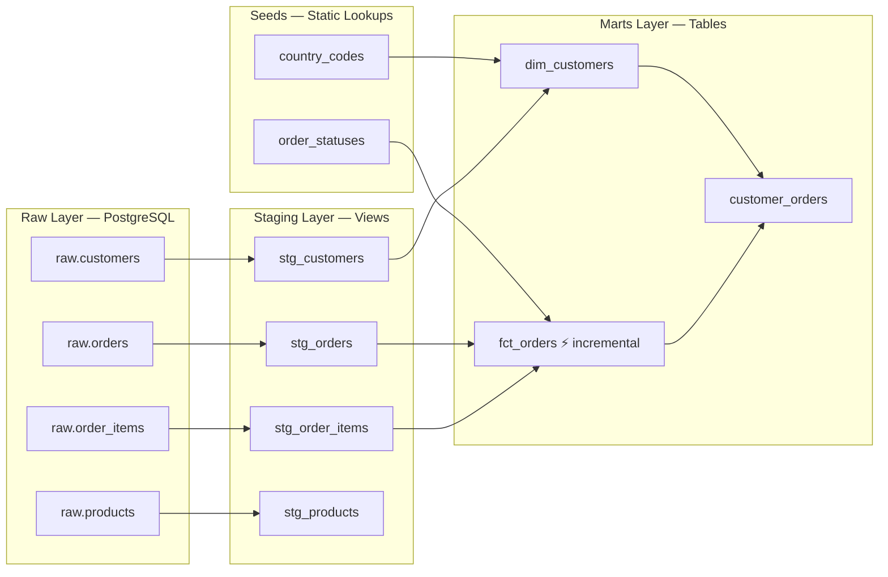

# dbt E-commerce Analytics Pipeline

**Production context:** A recurring pattern in retail and e-commerce client engagements: order and revenue reporting built on ad-hoc SQL against raw tables, no agreed definition of revenue, and reports breaking silently whenever the source schema changed. This project rebuilds that pattern end-to-end — a staging layer that isolates schema changes, a single revenue definition driven by a lookup table (not hardcoded logic), incremental loads that handle status changes without duplicating rows, and data quality tests that catch bad data before it reaches BI.

---

## Business Problem

Without a structured transformation layer, analysts wrote one-off SQL queries against raw tables. No agreed definitions. Revenue numbers differed between teams depending on which statuses they counted. When the source schema changed, every report broke silently.

What was needed:
- A single definition of revenue that every dashboard consumes
- Data quality gates that catch bad data before it reaches Power BI
- An audit trail from source to report (lineage)
- A daily refresh that handles status updates without creating duplicate rows

---

## Architecture



**Data flow:** Python script simulates Fivetran loading raw source data → dbt staging views clean and rename → dbt mart tables expose business-ready metrics.

---

## Design Decisions

### 1. Why 4 schemas (raw → seeds → staging → marts)?
Staging is a contractual boundary. If upstream renames `order_date` to `placed_at`, you fix it in `stg_orders.sql` and every downstream mart continues working unchanged. Raw is append-only (Fivetran's contract — we never write to it). Marts are what BI tools connect to.

### 2. Why is `is_revenue` a seed, not a hardcoded filter?
Revenue recognition logic belongs in a lookup table, not scattered across SQL. If a new status (`partially_refunded`) needs to be excluded from revenue, a non-technical ops person can update the CSV. No SQL change, no deployment — this is what prevents a mis-counted revenue figure the moment a new order state is introduced.

### 3. Why is `fct_orders` incremental with `unique_key='order_id'`?
Orders grow daily. Full-refreshing 300K+ rows every run is unnecessary load. More importantly, statuses change: a `shipped` order becomes `completed`. A naive incremental without `unique_key` would INSERT a second row for the same order rather than updating it. The `unique_key` config triggers a DELETE + INSERT strategy so the latest status always wins.

This is a common failure mode in production incremental models: without `unique_key`, a same-day status change produces a duplicate row instead of an update. The `unique` test on `order_id` is what catches it — the model fails the test before duplicated rows ever reach a BI tool.

**Soft delete cleanup via post-hook:** The staging layer filters `_fivetran_deleted = false`, so soft-deleted orders never enter new incremental batches. But without a cleanup step, the deleted order's existing row in `fct_orders` would remain as a ghost record — inflating order counts and revenue. The post-hook solves this by deleting any `order_id` from `fct_orders` that no longer exists in staging after every run:

```sql
delete from fct_orders
where order_id not in (select order_id from stg_orders)
```

**Downside at scale:** The `NOT IN` subquery performs a full scan of both tables on every run. At 300 rows this is instant. At 10M+ orders running every 30 minutes, this becomes expensive. Alternatives at scale:
- **Nightly full refresh** — cheaper overall than constant full scans; mart rebuilds clean from staging
- **Anti-join with EXISTS** — more query-planner-friendly than `NOT IN` on large datasets
- **Partition-based cleanup** — only scan recent partitions rather than the full table
- **Warehouse MERGE** — Snowflake and BigQuery support `MERGE` with delete conditions in a single atomic statement, avoiding the two-step approach

### 4. Why does `stg_order_items` compute `line_total`?
`line_total = unit_price × quantity × (1 − discount_pct / 100)` is a business fact, not a raw source field. Computing it once at the staging layer means every downstream model uses the same number. If the formula changes (e.g., tax added), one edit propagates everywhere.

### 5. Why the `generate_schema_name` macro?
dbt's default naming prepends the target profile name to schema names, producing `rohithkannan_staging` instead of `staging`. The macro overrides this so schema names in the database match what's in the code — no mental translation needed when debugging.

---

## What It Measures

| Metric | Value |
|--------|-------|
| dbt models | 7 (4 staging views + 3 mart tables) |
| Data quality tests | **16 / 16 passing** |
| Seeds (lookup tables) | 2 (country_codes, order_statuses) |
| Schemas | 4 (raw, seeds, staging, marts) |
| Rows in fct_orders | 300 orders |
| Rows in dim_customers | 100 customers |

**Test coverage includes:**
- `unique` + `not_null` on all primary keys
- `relationships` test: every order must have a matching customer (FK integrity)
- `accepted_values` on order status and country codes
- `not_null` on revenue — catches the case where the `order_statuses` seed join fails silently

**Source freshness:** `orders` table alerts if `_fivetran_synced` hasn't updated in 12 hours (warn) or 24 hours (error). Run with `dbt source freshness`.

---

## What Changes at Production Scale

| This POC | Production (Snowflake) |
|----------|----------------------|
| PostgreSQL, local | Snowflake — compute/storage separation, automatic micro-partitioning, time-travel for debugging |
| Manual `dbt run` | CI/CD: `dbt test` runs on every PR before merge. Broken tests block deployment |
| No alerting | CloudWatch / Slack alert if source freshness check fails |
| Synthetic data (300 orders) | Hundreds of thousands of orders, daily refresh |
| No column access controls | Row-level security in Power BI by business unit |

The incremental model and source freshness config are already structured for production — they work the same way at 300K rows.

---

## How to Run

**Prerequisites:** PostgreSQL running locally, Python 3.9+

```bash
# 1. Clone and set up environment
git clone <repo-url>
cd dbt_ecommerce
python -m venv .venv && source .venv/bin/activate
pip install dbt-postgres faker psycopg2-binary

# 2. Create the database
createdb dbt_ecommerce

# 3. Load raw data (simulates Fivetran)
export PGUSER=your_postgres_username
export PGPASSWORD=your_postgres_password
python scripts/generate_raw_data.py

# 4. Configure dbt profile
# Edit ~/.dbt/profiles.yml — see profiles.yml.example

# 5. Run everything
dbt deps
dbt seed          # Load lookup tables
dbt run           # Build all models
dbt test          # Run 16 data quality tests

# 6. View lineage docs (optional)
dbt docs generate && dbt docs serve
```

**Incremental runs** (after initial load):
```bash
dbt run  # Only processes orders with new _fivetran_synced timestamps
dbt run --full-refresh  # Rebuilds everything from scratch
```

---

## Stack

| Layer | Tool | Why |
|-------|------|-----|
| Database | PostgreSQL | Standard relational; production equivalent is Snowflake |
| Transformation | dbt Core 1.x | Industry standard for analytics engineering |
| Raw data | Python + Faker | Simulates Fivetran sync pattern with metadata columns |
| Docs + lineage | dbt docs | Full column-level lineage from source to mart |
